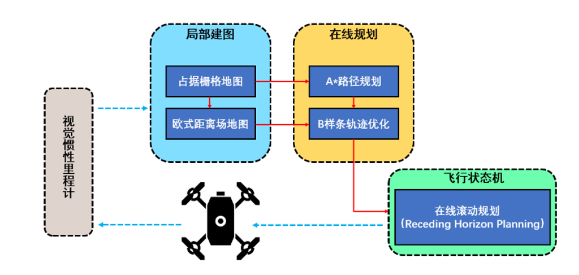
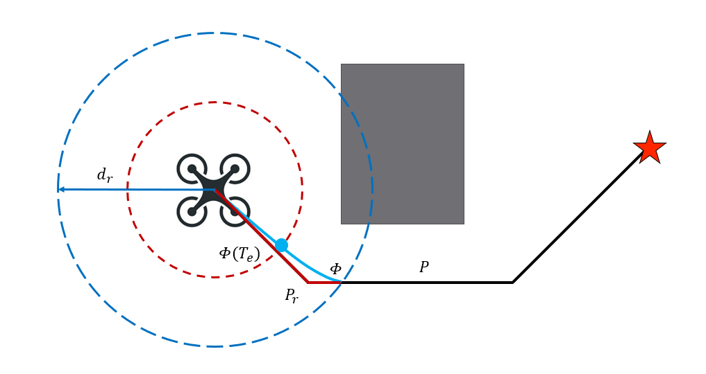

# flag planner
轻量化的无人机规划器，有任何问题请在issues部分提问。

目前已经知道的问题是代码在编译时会提示缺失部分自定义的消息头文件，这个是CMAKE编译链接导致，如果出现缺少"<bsplieTraj.h>"，反复编译几次即可。这个bug会在后面解决。。
## Table of Contents

* [介绍](#介绍)  
  * [1.算法框架](#jump1)
  * [2.Astar](#jump2)
  * [3.Bspline](#jump3)
  * [4.RHP](#jump4)
  * [5.nlopt](#jump5)
  
* [用法](#用法)


## 介绍
### <span id="jump1"> 1. 算法框架  </span>
在视觉-IMU松耦合的融合定位算法得到的位姿信息以及环境感知算法得到的栅格地图的基础上，设计基于 A*的路径生成方法，对得到的栅格地图进行膨胀以保证初始可行解的安全性；根据设计基于 B样条的轨迹优化方法，结合定时触发与碰撞触发两种逻辑实现无人机自主生成连续、光滑、安全且满足无人机动力学可行性的轨迹；针对具有有限感知范围的无人机在未知环境中自主导航的问题，构建了
Receding Horizon Planning (RHP)框架，在可信的地图范围内进行路径规划，提高了规划模块生成轨迹的鲁棒性。
<p id="struct1" align="center">
  
</p>  

### <span id="jump2"> 2. Astar </span>
使用A*算法实现无人机当前位置到目标位置的实时路径规划。该算法维护了一个启发式估价函数：  

&space;=&space;g(n)&space;&plus;&space;h(n))   

该函数以最短路径为优化目标，g(n)为起始节点到当前节点的代价，h(n)为启发式函数，表示当前节点到终点的代价。考虑到计算速度与路径长度，结合所使用的栅格模型，将启发函数设置为对角线距离。

### <span id="jump3"> 3. Bspline </span>
由于四旋翼无人机具有微分平坦特性，因此本设计在四旋翼平坦空间进行规划，最终解算的控制指令映射到全状态空间实现无人机实时的姿态控制。本设计采用 B 样条曲线作为运动基元生成参考轨迹，并将样条曲线控制点作为优化变量。为保证边界状态不改变，忽略起点与终点各 3 个控制点，只对进行优化。构建优化函数的表达式如下：


其中分别为平滑度、碰撞度和可行性成本。是每个成本项的权重。平滑度成本定义为最小化 jerk 项，碰撞度成本定义为当前控制点集在欧式距离场地图（ESDF）上的和，可行性成本定义为轨迹对速度和加速度上下界的违背程度。各项成本的表达式与梯度函数均为解析函数，初始可行解由 A*算法给出。在此基础上，使用梯度下降法 `L-BFGS` 可实现快速求解。

### <span id="jump4"> 4. RHP </span>
为了在未知环境中通过局部信息实现无人机的自主导航，本方案使用 Receding Horizon Planning (RHP)不断生成轨迹，直至无人机到达最终目标。这里将滑动窗划定在从无人机当前位置到可信感知范围的最长距离dr处。当 A*规划了一条从起点到目标的路径时，RHP 框架判断当前只使用该路径的一部
分，即以无人机当前位置为圆心的半径dr范围内的路径Pr。无人机遵循定时触发与碰撞触发逻辑，在两次触发之间的一个不定的时间范围称之为执行范围$e。触发重新规划后，为了保证所生成的轨迹的平滑性，轨迹生成的起始状态由当前无人机状态)确定。由于触发间隔时间Te远大于生成轨迹所需的时间，因此机器人在执行完当前轨迹后总是能够过渡以跟踪新轨迹。
<p id="struct2" align="center">
  
</p>  

### <span id="jump5"> 5. nlopt </span>
NLOPT中有多种可以选择的算法，在头文件里面算法名称的枚举类型为
```c++
enum algorithm {  
     GN_DIRECT = 0,  
     GN_DIRECT_L,  
     GN_DIRECT_L_RAND,  
     GN_DIRECT_NOSCAL,    
     GN_DIRECT_L_NOSCAL,  
     GN_DIRECT_L_RAND_NOSCAL,  
     GN_ORIG_DIRECT,  
     GN_ORIG_DIRECT_L,  
     GD_STOGO,  
     GD_STOGO_RAND,  
     LD_LBFGS_NOCEDAL,  
     LD_LBFGS,  
     LN_PRAXIS,
     LD_VAR1,   
     LD_VAR2,  
     LD_TNEWTON,  
     LD_TNEWTON_RESTART,  
     LD_TNEWTON_PRECOND,  
     LD_TNEWTON_PRECOND_RESTART,  
     GN_CRS2_LM,    
     GN_MLSL,  
     GD_MLSL,  
     GN_MLSL_LDS,  
     GD_MLSL_LDS,  
     LD_MMA,  
     LN_COBYLA,  
     LN_NEWUOA,  
     LN_NEWUOA_BOUND,  
     LN_NELDERMEAD,  
     LN_SBPLX,  
     LN_AUGLAG,  
     LD_AUGLAG,  
     LN_AUGLAG_EQ,  
     LD_AUGLAG_EQ,  
     LN_BOBYQA,    
     GN_ISRES,  
     AUGLAG,  
     AUGLAG_EQ,  
     G_MLSL,  
     G_MLSL_LDS,  
     LD_SLSQP,   
     LD_CCSAQ,   
     GN_ESCH,  
     NUM_ALGORITHMS /*不是一种算法 只是算法的数量*/   
  };  
```
  
- 命名规律：
**G/L**代表的就是 **全局（global）** 或者 **局部（local）** 优化，N/D代表的就是 不需导数 或者 需要导数 的优化.  
例如 LN_COBYLA 就是用的 COBYLA 算法 ，然后该算法用于局部（L）无需导数（N）的优化. 
  

更多使用可以参考[Nlopt使用](https://www.guyuehome.com/35169)。  


## 用法
该项目已经在Ubuntu 18.04(ROS Melodic)和20.04(ROS Noetic)上进行了测试。由于代码中集成了实际飞行需要使用的VINS定位，因此需要先进行依赖库的配置，配置请参考[ZJU-Fast-Lab课程](https://github.com/ZJU-FAST-Lab/Fast-Drone-250)中[VINS的环境配置](https://www.bilibili.com/video/BV1WZ4y167me?p=8)。如不考虑实际飞行，可以删除代码中的`VINS-Fusion`。

运行以下命令编译源代码: 

1.在ubuntu 18.04上

```
sudo apt-get install ros-melodic-nlopt
cd ${YOUR_WORKSPACE_PATH}
git clone https://github.com/SmartGroupSystems/flag_planner.git
catkin_make
```

2.在ubuntu 20.04上

必须要采用源码安装Nlopt，进入[Nlopt源码下载](https://nlopt.readthedocs.io/en/latest/)，下载完成后解压，测试采用了2.7.1版本。
```
cd nlopt-2.7.1
mkdir build
cd build
cmake ..
make
sudo make install
```

在这之后，进入你的工作空间
```
cd ${YOUR_WORKSPACE_PATH}
git clone https://github.com/SmartGroupSystems/flag_planner.git
catkin_make
```

编译完成后，需要在`.bashrc`文件中最后一行添加命令：
```
source ${YOUR_WORKSPACE_PATH}/devel/setup.bash 
eval "$RUN_AFTER_BASHRC"
```

重启终端或运行`source ~/.bashrc`以应用改动。通过以下方式启动仿真器:    
```linux-kernel-module
./static_planner.sh
```
 `rviz`中会生成随机地图与无人机，使用`2D Nav Goal`为无人机选择目标。这里展示了一个模拟示例：

<!-- add some gif here -->
 <p id="gif1" align="center">
  
 </p>


